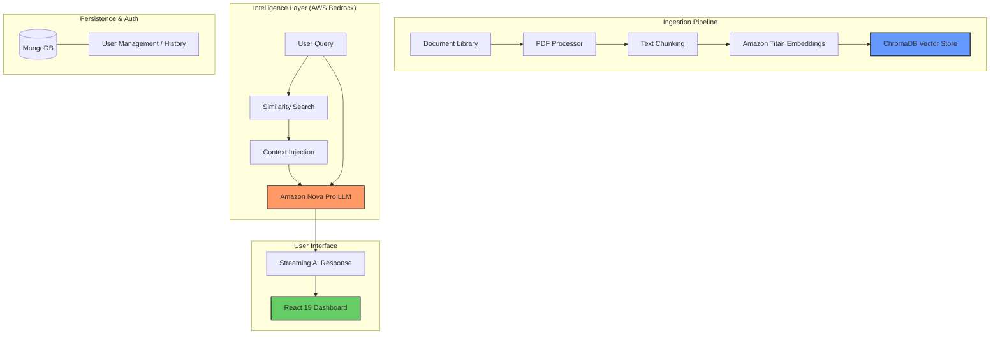

# 🛡️ Veridoc: Enterprise AI Document Intelligence Platform

**Veridoc** is a production-grade Retrieval-Augmented Generation (RAG) platform that transforms static document libraries into interactive, searchable knowledge bases. By combining the power of **AWS Bedrock**, **FastAPI**, and **React 19**, Veridoc provides businesses with a secure, scalable way to extract precise answers from complex document sets.

---

## 🎯 The Vision
In an era of information overload, Veridoc solves the problem of "dark data" by indexing PDFs and making them queryable via natural language. Whether it's corporate policies, technical manuals, or legal contracts, Veridoc ensures that the right information is always just one chat away.

### 💎 Key Capabilities
- **🧠 Advanced RAG Engine**: Utilizes **Amazon Nova Pro** for deep contextual reasoning and **Amazon Titan V2** for high-performance embeddings.
- **🔍 Semantic Intelligence**: Goes beyond keyword matching to understand the *meaning* of your queries using vector similarity search.
- **🔐 Enterprise Security**: Built with robust JWT-based authentication and secure handling of AWS credentials.
- **⚡ High-Performance UI**: A sleek, responsive dashboard built with **React 19**, **Vite**, and **Tailwind CSS**, optimized for lightning-fast interactions.
- **☁️ Cloud-Native Deployment**: Fully containerized with Docker and optimized for AWS (EC2/ECR) scaling.

---

## 🏗️ Technical Architecture



---

## 🛠️ Technology Stack

| Layer | Technology |
| :--- | :--- |
| **Frontend** | React 19, Vite, Tailwind CSS, Shadcn UI, Radix UI |
| **Backend** | FastAPI (Python 3.12+), LangChain, Pydantic |
| **AI/ML** | AWS Bedrock (Nova Pro V1, Titan Embeddings V2) |
| **Databases** | MongoDB (Metadata/Auth), ChromaDB (Vector Search) |
| **DevOps** | Docker, AWS ECR/EC2, GitHub Actions |

---

## 🚀 Getting Started

### 📋 Prerequisites
- Python 3.12+ (Use `uv` for best performance)
- Node.js & pnpm
- AWS Account with Bedrock access (Nova & Titan enabled)
- MongoDB instance

### 1. Configuration
```bash
git clone https://github.com/Gautam29013/Veridoc.git
cd Veridoc

# Setup environment variables
cp .env.example .env
# Required: AWS_ACCESS_KEY, AWS_SECRET_ACCESS_KEY, MONGODB_URL
```

### 2. Backend Initialization
```bash
cd backend
# Install dependencies and start server
uv run python main.py
```
> [!TIP]
> To index your own documents, place PDFs in `backend/data/sample_documents/` and run:
> `uv run python index_documents.py`

### 3. Frontend Execution
```bash
cd frontend
pnpm install
pnpm dev
```

---

## 📂 Project Structure

```text
├── backend/            # FastAPI RAG API
│   ├── api/            # Routes & Controllers
│   ├── services/       # Bedrock & Vector Storage logic
│   └── data/           # Document ingestion source
├── frontend/           # Modern React Dashboard
│   └── src/            # Components & UI Logic
├── docker/             # Containerization configs
└── vector_db/          # Persistent local vector storage
```

---

## 🤝 Contributing
Contributions are welcome! Please feel free to submit a Pull Request.

## 📄 License
Distributed under the **MIT License**.

---
**Built for the future of Document Intelligence.**
