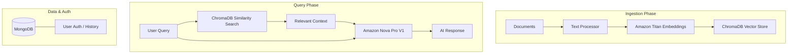

# Veridoc — AI-Powered Document Analysis Platform

[](https://opensource.org/licenses/MIT)
[](https://fastapi.tiangolo.com/)
[](https://reactjs.org/)
[](https://aws.amazon.com/bedrock/)

**Veridoc** is a state-of-the-art Retrieval-Augmented Generation (RAG) platform designed to transform static documents into interactive knowledge bases. Leveraging AWS Bedrock's powerful language models and ChromaDB's efficient vector storage, Veridoc provides precise, context-aware answers to complex queries across your document library.

---

## ✨ Key Features

- 🧠 **AI-Powered Insights**: Utilize AWS Bedrock (Amazon Nova Pro) for high-accuracy document comprehension.
- 🔍 **Semantics Search**: Deep document indexing with Amazon Titan Embeddings for relevant information retrieval.
- ⚡ **Real-time Chat**: Interactive chat interface with persistent history and context awareness.
- 🔐 **Secure Authentication**: Robust user management with JWT-based auth and MongoDB storage.
- 📊 **Scalable Vector Storage**: Powered by ChromaDB for lightning-fast similarity searches.
- ☁️ **Cloud Native**: Fully containerized with Docker and ready for AWS EC2/ECR deployment.

---

## 🛠️ Technology Stack

| Layer          | Technology                                                                 |
|----------------|----------------------------------------------------------------------------|
| **Frontend**   | React 19, Vite, Tailwind CSS, Shadcn UI, Radix UI                          |
| **Backend**    | FastAPI, Python 3.12+, LangChain                                           |
| **AI Models**  | AWS Bedrock (Amazon Nova Pro V1, Amazon Titan Embeddings V2)             |
| **Databases**  | MongoDB (User Metadata), ChromaDB (Vector Store)                           |
| **Infrastructure** | Docker, AWS (EC2, ECR), GitHub Actions (CI/CD)                         |

---

## 🏗️ Architecture & Workflow

The platform follows a standard RAG (Retrieval-Augmented Generation) pipeline:



---

## 🚀 Getting Started

### Prerequisites

- **Python 3.12+** (Recommended: `uv` for package management)
- **Node.js & pnpm/npm**
- **AWS Credentials** with Bedrock access
- **MongoDB** instance (local or Atlas)

### 1. Project Configuration

Clone the repository and set up your environment variables:

```bash
cp .env.example .env
# Edit .env with your AWS_ACCESS_KEY, AWS_SECRET_ACCESS_KEY, MONGODB_URL, etc.
```

### 2. Backend Setup

```bash
cd backend
# Install dependencies using uv
uv run python main.py
```
*The API will be available at `http://localhost:8000`*

### 2.1 Quick Start: Document Indexing Setup

`backend/index_documents.py` resolves the input directory as:
`os.path.join(base_dir, "data", "sample_documents")`, where `base_dir` is `backend/`.

Create this directory and place your sample PDFs there:

```text
backend/
└── data/
    └── sample_documents/
        ├── handbook.pdf
        └── policy.pdf
```

Accepted formats: **PDF only** (the loader uses `glob="**/*.pdf"`).

Run indexing after adding PDFs:

```bash
cd backend
uv run python index_documents.py
```

### 3. Frontend Setup

```bash
cd frontend
pnpm install
pnpm dev
```
*The frontend will be available at `http://localhost:5173`*

---

### Required GitHub Secrets

- `AWS_ACCESS_KEY_ID` / `AWS_SECRET_ACCESS_KEY`
- `AWS_DEFAULT_REGION`
- `ECR_REPO`

---

## 📂 Project Structure

```text
├── backend/            # FastAPI Application
│   ├── api/            # Routes (Auth, Documents, Queries)
│   ├── models/         # Pydantic & Database Schemas
│   ├── services/       # Bedrock & Vector Storage logic
│   └── utils/          # Helpers & Middleware
├── frontend/           # React Application
│   ├── src/            # Components, Hooks, & Assets
│   └── public/         # Static assets & Logo
├── vector_db/          # Persistent ChromaDB storage
└── docker/             # Docker configuration files
```

---

## 📄 License

This project is licensed under the MIT License - see the [LICENSE](LICENSE) file for details.
